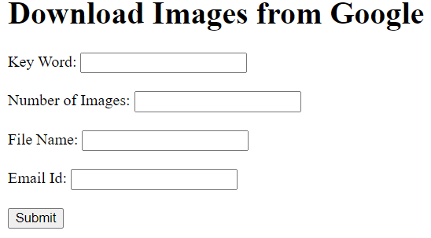

---

# Image Downloader

This project allows users to download bulk images based on a specified keyword. It provides a simple web interface for inputting parameters such as the keyword, number of images, desired output file name, and recipient email.

## Features

- Input fields for:
  - Keyword (to search for images)
  - Number of Images (to download)
  - File Name (for the output file)
  - Recipient Email (for sending the downloaded images)
- Image downloading functionality
- Zipping and emailing the downloaded images

## Technologies Used

- Python
- Flask
- Requests (for downloading images)
- Jinja2 (for templating)
- HTML/CSS

## Installation

1. Clone the repository:

   ```bash
   git clone <repository-url>
   ```

2. Navigate to the project directory:

   ```bash
   cd <project-directory>
   ```

3. Install the required packages:

   ```bash
   pip install Flask requests
   ```

## How to Run

1. Ensure that you have all the necessary files in the same directory.
2. Run the Flask application:

   ```bash
   python app.py
   ```

3. Open your web browser and navigate to `http://127.0.0.1:5000/` to access the application.


4. Fill in the form with the required information:
   - **Key Word**: Enter the keyword for the images you want to download.
   - **# of Images**: Specify the number of images to download.
   - **File Name**: Enter the desired name for the output zip file.
   - **Email Id**: Provide the email address to send the zip file to.
5. Click the **Submit** button to process your request.

## Example Input

- **Key Word**: Bike
- **# of Images**: 100
- **File Name**: bike_images
- **Email Id**: example@example.com

## Output

The application will download the specified number of images related to the keyword, zip them into a file with the specified name, and send the zip file to the provided email address.

## License

This project is licensed under the MIT License.

---
